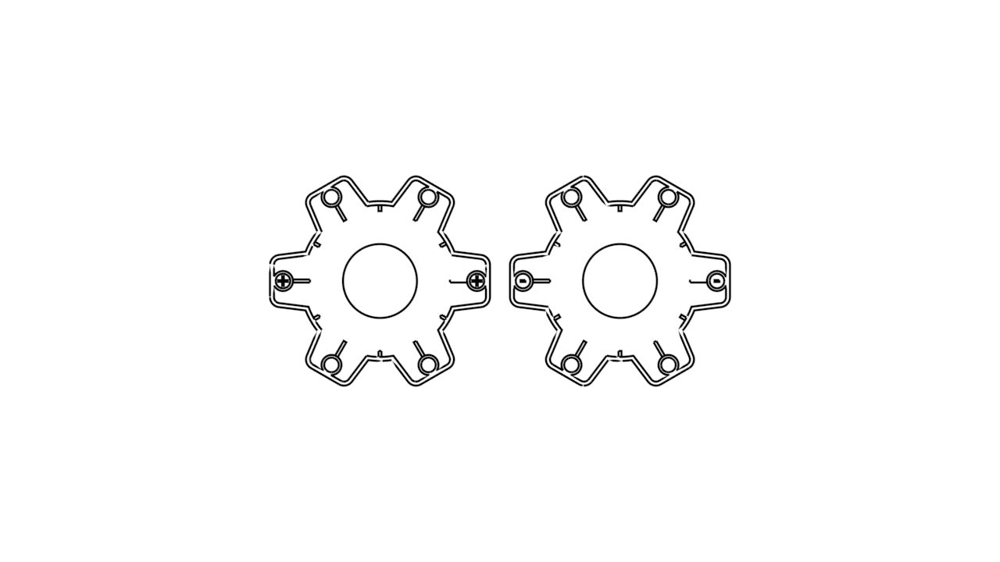

# Gear Box

- Download from Printables here: [`Download Link`](https://www.printables.com/model/510575-gear-box)
- Download from Thingiverse here: [`Download Link`](https://www.thingiverse.com/thing:6441442)

## Summary

An artistic box in the shape of a gear!

* * *

# Summary

An artistic box in the shape of a gear! In the place of the shaft is a mirror that artistically simulates a hole passing through the box. The two sides of the box are held together by magnets. (Perhaps some left over from a Voron Klicky Probe?)

This model was made from the DXF file I used to create a logo for my college's engineering club. I really liked the proportions and thought it looked good as a physical item. I later turned it into a box to hold other printed gears from various projects.

- **The box is available in four variations:**
	- 2.75 inch mirror, 6 mm diameter magnet
	- 2 inch mirror, 6 mm diameter magnet
	- 3 inch mirror, 6 mm diameter magnet

# Print Settings

- Supports: None
- Infill: 20%
	- Bottom fill pattern: Archimedean Chords
- Brim: false

# Bill of Materials

- Two identical round mirrors.
- At least four magnets.
- Permanent adhesive
- Adhesive putty

# Assembly

- Select the model which best fits your mirror and magnet size. (Print two gear halves of the same variation.
- After printing each gear half, place both halves with the open side facing up.
- Orient both gears to where one spur from each gear is touching flat against the other.
- Add glue to the holes spanning left to right. (There should be four holes total.)
- Verify each magnet's polarity and place one magnet in each hole containing glue. An example is provided below:

- Do not connect the gear halves until the glue completely dries.
- Roll the adhesive putty so that its length matches the circumference of the mirror. Shape the adhesive putty roll into a ring by connecting each end. Do this for a total of two times.
- Adhere the putty to the reflective side of the mirror at an even distance from the center of the mirror. Do this for both mirrors.
- Attach a mirror to each gear half by firmly pressing the mirror assembly into the center of each gear half. This won't take any time to set.

# Additional Information

- **Notes**
    - An adapter is provided to adapt a 2 inch mirror into the 2.75 inch mirror variant. The adapter flexes slightly to allow sliding the mirror into place, and snapping the tabs around the edge of the mirror. Be sure to exercise caution when handling the mirror.

- **Optional**
	- You can line the inside of each gear half assembly with batting, felt, or even tool drawer liner. Provided with the model is an SVG file with the pattern in each size for this use.
	- You can replace the mirrors with a different material like something transparent or a 3D-printed disk in a different filament.

- **Warnings**
    - Glass is glass, and glass breaks—including mirrors. They do not mix well with nuts, bolts, and other small metal masses. If you're planning on using this box to hold any of these items, make sure to line both sides of the gear halves to prevent any unexpected breaking.

# A Note from the Designer

Hey! Thanks for checking out my design, and I hope you have a good time with it. If you've printed and assembled this design, I'd love to see it. Post a make of this model to the [Printables](https://www.printables.com/model/510575-gear-box) page assembled and sitting on a workbench, desk, or bookshelf. (You can set the box on its teeth or on one side.) If you have any issues with the original model, please let me know, and you can even open an issue on this model's [GitHub](https://github.com/EvokeMadness/gear-box) page. If you have any suggestions for variants of this model, please leave a comment, and I also want to encourage remixes of this design. The source files for this design can be found on its [GitHub](https://github.com/EvokeMadness/gear-box) page.

Happy printing!

* * *

# Previews

